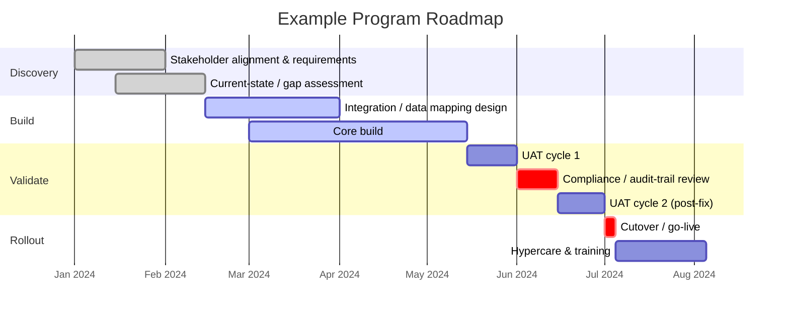

# Program Roadmap Template (Mermaid)

A generalized four-phase roadmap shape I use for regulated, multi-stakeholder programs — discovery, build, validate, rollout — with compliance/audit gates called out explicitly rather than buried inside a phase.

## Why this shape

The compliance/audit-trail review sits as its own critical-path block, not folded into "testing" — in regulated environments (FDA, HIPAA, DHCS/CMS), that review gates go-live and deserves its own visible milestone stakeholders can track. Hypercare after cutover is a deliberate phase, not an afterthought — the two weeks after go-live are where zero-disruption cutovers are actually won.
